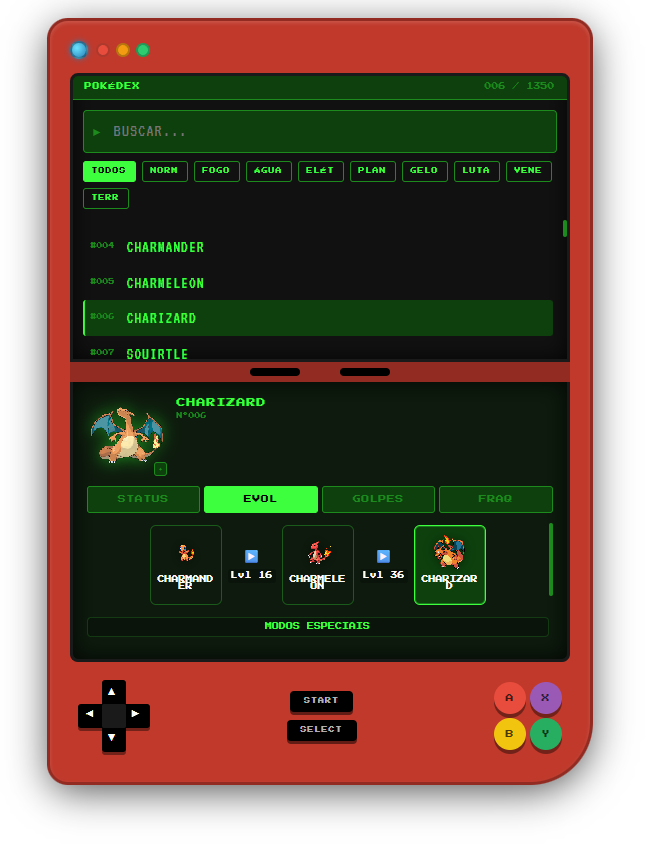

# 📱 Pokédex App

> Pokédex estilo Game Boy construída com React, TypeScript e PokéAPI.


***

## ✨ Funcionalidades

- 🔍 **Busca em tempo real** com debounce por nome do Pokémon
- 🎨 **Filtro por tipo** (Fogo, Água, Planta, Elétrico, etc.) via endpoint `/type` da PokéAPI
- ⌨️ **Navegação por teclado** com as setas ↑ ↓
- 📊 **4 abas de detalhe** para cada Pokémon:
  - **STATUS** — tipos, flavor text e barras de stats animadas
  - **EVOL** — cadeia de evolução clicável
  - **GOLPES** — até 12 golpes ordenados por nível
  - **FRAQ** — fraquezas e resistências com multiplicadores (4×, 2×, ½×...)
- ✦ **Toggle Shiny** — alterna entre sprite normal e shiny
- 🔢 **Contador** — exibe `001 / 1025` ao selecionar um Pokémon
- 💾 **Cache automático** com React Query — sem requisições desnecessárias

***

## 🛠️ Tecnologias

| Tecnologia | Versão | Uso |
|---|---|---|
| React | 18 | Interface |
| TypeScript | 5 (strict) | Tipagem |
| Vite | 5 | Build tool e dev server |
| @tanstack/react-query | 5 | Cache e gerenciamento de requisições |
| Axios | 1+ | HTTP client |
| Zustand | 4 | Estado global leve |
| Bootstrap | 5 | Utilitários CSS |
| PokéAPI | v2 | Dados dos Pokémons |

***

## 📁 Estrutura de Pastas

```
src/
├── types/
│   └── pokemon.ts            # Interfaces TypeScript (Raw API + ViewModels)
├── services/
│   └── pokeapi.ts            # Wrapper Axios para a PokéAPI
├── utils/
│   └── pokemonMapper.ts      # Mapeia respostas brutas → ViewModels + calcula fraquezas
├── hooks/
│   ├── useDebounce.ts        # Debounce da busca
│   ├── usePokemonList.ts     # Lista completa com cache infinito
│   ├── usePokemonDetail.ts   # Detalhe: pokémon + espécie + evolução + tipos em paralelo
│   └── usePokemonsByType.ts  # IDs de pokémons por tipo
├── store/
│   └── usePokemonStore.ts    # Zustand: selectedId, aba ativa, shiny, filtros
├── styles/
│   ├── tokens.css            # Variáveis CSS (cores do device, tela LCD, tipos)
│   └── base.css              # Reset + animações + import das fontes
└── components/
    ├── ui/                   # Átomos reutilizáveis
    │   ├── TypeBadge.tsx     # Badge colorido por tipo
    │   ├── StatBar.tsx       # Barra de stat com animação de entrada
    │   ├── Spinner.tsx       # Loading indicator
    │   └── ScreenTabs.tsx    # Abas STATUS / EVOL / GOLPES / FRAQ
    ├── layout/               # Shell do dispositivo
    │   ├── DeviceShell.tsx   # Corpo do Game Boy (D-Pad, botões, telas)
    │   ├── UpperScreen.tsx   # Tela superior: busca + filtros + lista
    │   └── LowerScreen.tsx   # Tela inferior: detalhe do Pokémon selecionado
    └── pokedex/              # Componentes de conteúdo
        ├── PokemonItem.tsx   # Item da lista (número + nome)
        ├── PokemonList.tsx   # Lista com filtro por nome e tipo + nav por teclado
        ├── TypeFilter.tsx    # Botões de filtro por tipo
        └── panels/           # Painéis das 4 abas
            ├── StatusPanel.tsx
            ├── EvolutionPanel.tsx
            ├── MovesPanel.tsx
            └── WeaknessPanel.tsx
```

***

## 🚀 Como Rodar

### Pré-requisitos

- **Node.js** 18 ou superior
- **npm** 9 ou superior

### Instalação

```bash
# 1. Clone ou extraia o projeto
cd pokedex-app

# 2. Instale as dependências
npm install

# 3. Rode o servidor de desenvolvimento
npm run dev
```

Acesse **http://localhost:5173** no navegador.

### Build para produção

```bash
npm run build
npm run preview   # Para visualizar o build localmente
```

***

## ⚙️ Variáveis de Ambiente

Crie um arquivo `.env` na raiz do projeto:

```env
VITE_POKEAPI_BASE_URL=https://pokeapi.co/api/v2
```

> O `.env` já vem incluído no projeto com esse valor padrão.

***

## 🎮 Como Usar

1. **Selecione um Pokémon** clicando na lista ou navegando com ↑ ↓
2. **Busque por nome** no campo de texto (ex: `char` filtra Charmander, Charmeleon, Charizard)
3. **Filtre por tipo** clicando nos botões (FOGO, ÁGUA, etc.) — clique em TODOS para resetar
4. **Explore as abas** na tela inferior:
   - **STATUS** — stats com barras animadas
   - **EVOL** — clique em qualquer estágio para navegar na cadeia
   - **GOLPES** — golpes por nível e TM
   - **FRAQ** — fraquezas em vermelho, resistências em verde
5. **Alterne Shiny** clicando no botão ✦ no sprite do Pokémon

***

## 🏗️ Decisões de Arquitetura

### Por que React Query?
A PokéAPI tem rate limit. Com `staleTime: Infinity` no React Query, cada Pokémon é buscado **uma única vez por sessão** e fica em cache — sem refetch desnecessário ao clicar no mesmo Pokémon várias vezes.

### Por que Zustand?
O estado compartilhado entre `UpperScreen` e `LowerScreen` (Pokémon selecionado, aba ativa, shiny) é simples demais para Context API + useReducer, mas precisa ser acessível em múltiplos componentes. Zustand resolve isso com zero boilerplate.

### Por que separar `services/` de `hooks/`?
- `services/` fala **apenas com a API** — sem React, sem estado, testável isoladamente
- `hooks/` conecta os serviços ao React Query — responsável pelo cache e loading states
- `utils/` transforma dados brutos em ViewModels — lógica pura sem dependências externas

### Filtro por tipo
A lista da PokéAPI (`/pokemon?limit=1025`) não inclui o tipo de cada Pokémon. Em vez de fazer 1025 requisições para descobrir os tipos, o app usa o endpoint `/type/{nome}` que retorna diretamente todos os IDs dos Pokémons daquele tipo — uma única requisição por tipo.

***

## 📦 Scripts Disponíveis

| Comando | Descrição |
|---|---|
| `npm run dev` | Inicia o servidor de desenvolvimento |
| `npm run build` | Gera o build de produção em `/dist` |
| `npm run preview` | Visualiza o build de produção localmente |
| `npm run lint` | Executa o ESLint |

***

## 🔗 Recursos

- [PokéAPI Documentation](https://pokeapi.co/docs/v2)
- [React Query Docs](https://tanstack.com/query/latest)
- [Zustand Docs](https://zustand-demo.pmnd.rs/)
- [Vite Docs](https://vitejs.dev/)

## Screenshots
 
### Pokedex
